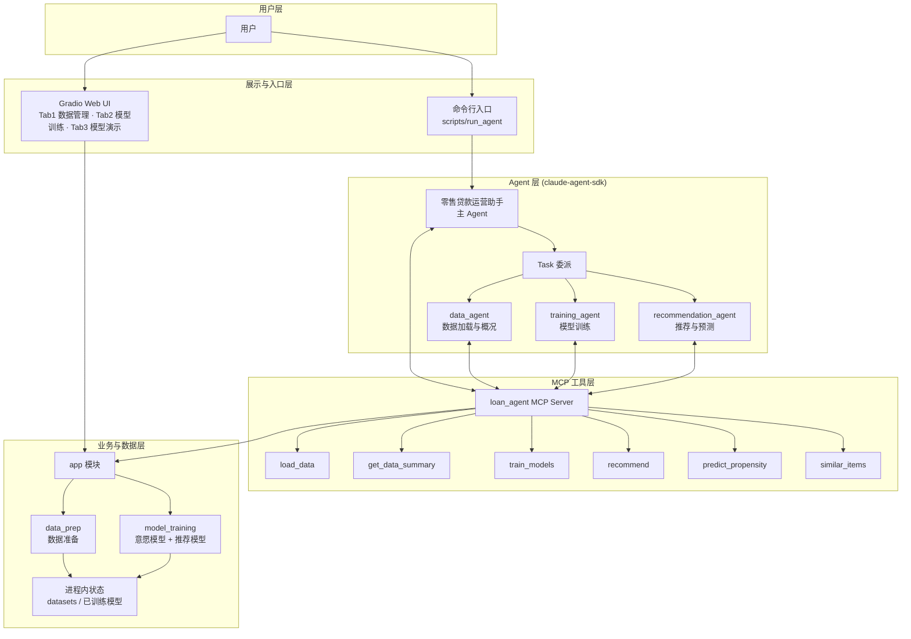
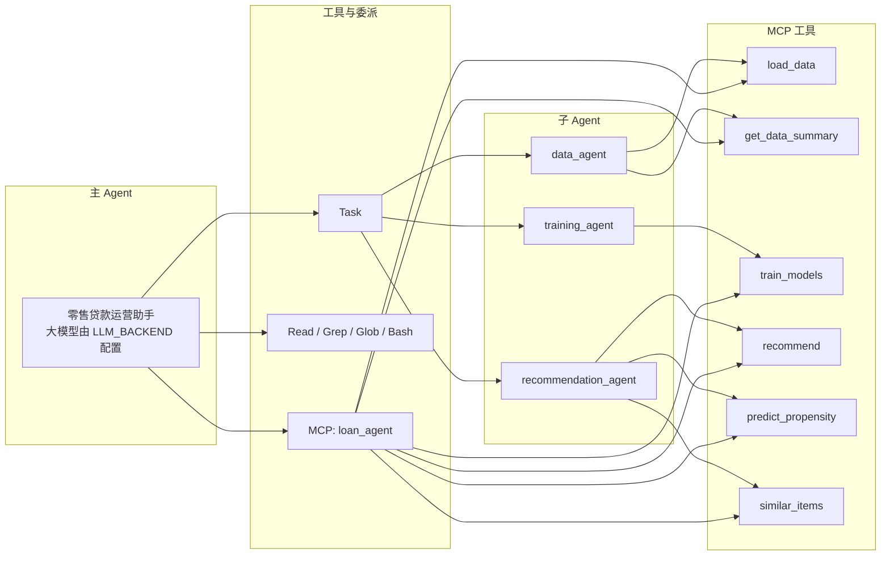
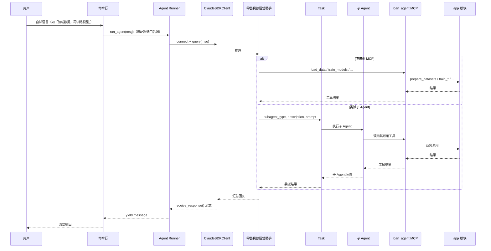
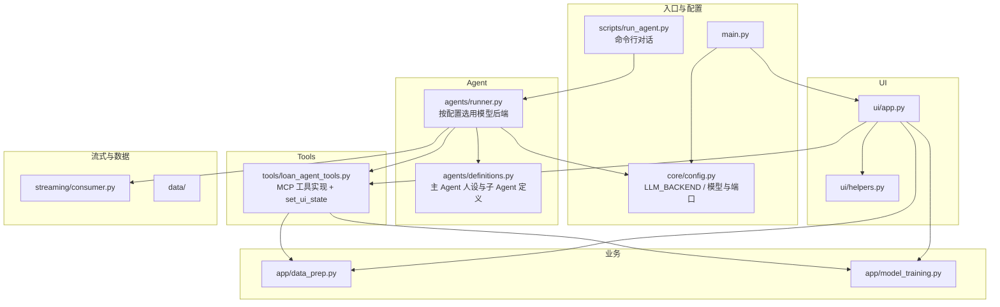
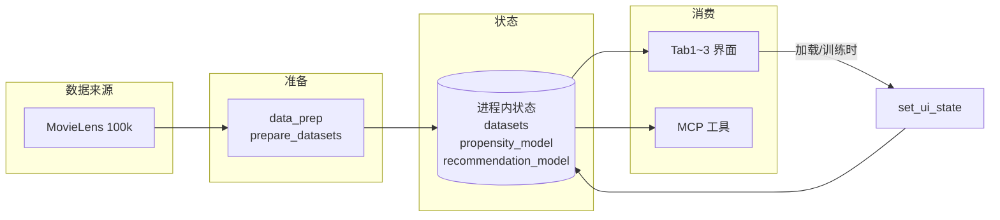

# 零售贷款智能运营 — 架构设计图

本文档用 Mermaid 图系统展示整体架构，可在支持 Mermaid 的 Markdown 查看器（如 GitHub、VS Code 插件、Typora）中直接渲染。

---

## 1. 系统总体架构（分层视图）

**说明**：用户通过 Gradio 使用数据管理、模型训练、模型演示三个步骤（直接操作 app 与状态）；或通过命令行入口（`scripts/run_agent`）与主 Agent 交互。主 Agent 仅由命令行触发，由 claude-agent-sdk 驱动，模型后端由 `core.config.LLM_BACKEND` 配置。主 Agent 可直接调用 MCP 工具，也可通过 Task 委派子 Agent；子 Agent 与主 Agent 共用同一 MCP 服务，工具实现落在 app 模块并共享进程内状态。

---

## 2. Agent 与 Sub-Agent、MCP 调用关系

**说明**：主 Agent 可调用 Task（委派子 Agent）、内置工具（Read/Grep/Glob/Bash）、以及 MCP 的 6 个工具；三个子 Agent 各自只能调用其职责范围内的 MCP 工具。

---

## 3. 命令行 Agent 对话请求流

**说明**：仅命令行入口（`python -m scripts.run_agent`）触发此流。用户输入经 Runner 进入 SDK（按 `LLM_BACKEND` 选用模型），主 Agent 可选择直接调 MCP 或通过 Task 交给子 Agent；子 Agent 调 MCP → app，结果逐级返回并以流式消息输出到控制台。

---

## 4. 模块与文件映射

**说明**：根目录仅保留 `main.py`；配置在 `core/config.py`，命令行 Agent 对话在 `scripts/run_agent.py`。Web UI（`ui/app.py`）仅含数据管理、模型训练、模型演示三个 Tab，不调用 runner；Agent 仅由 `scripts/run_agent` 调用。数据与模型状态在 `loan_agent_tools` 的进程内状态中，供 UI 与命令行 Agent 共用。

---

## 5. 数据与状态流

**说明**：数据经 data_prep 产出后写入进程内状态；界面操作（加载、训练）通过 `set_ui_state` 同步状态，命令行 Agent 通过 MCP 工具读写同一状态。

---

以上五图从**分层总览、Agent/MCP 关系、对话时序、模块映射、数据状态**五方面描述架构；若需导出为 PNG/SVG，可使用 [Mermaid Live Editor](https://mermaid.live) 或 VS Code 的 Mermaid 插件渲染后导出。
